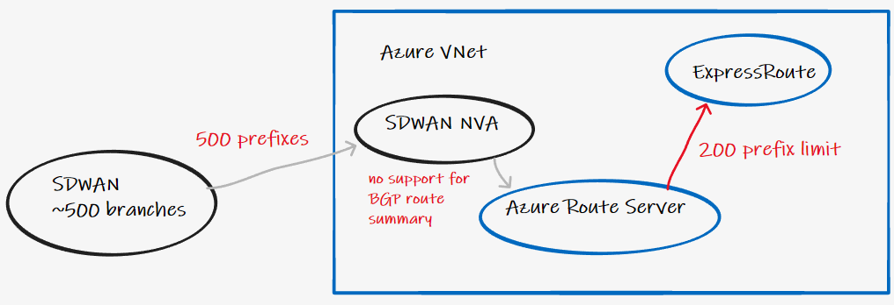
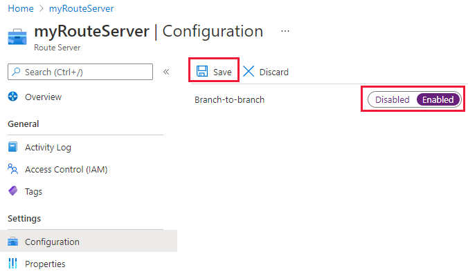
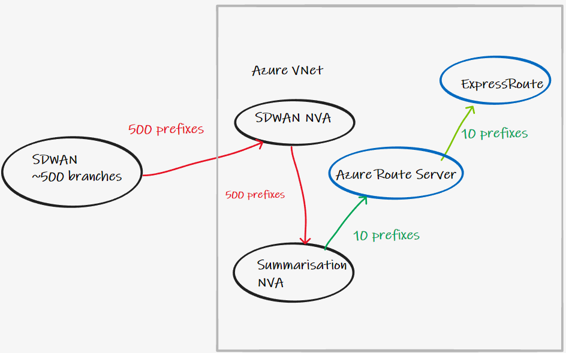
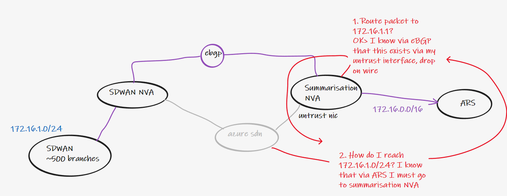
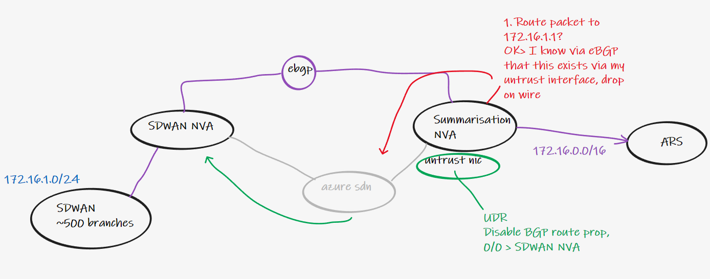
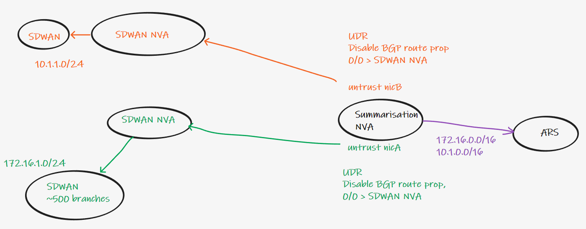
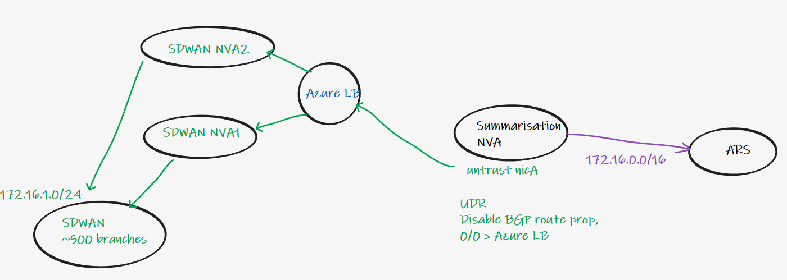

# Azure Route Server - prefix limits and summarisation

# Summary

When using Azure Route Server (ARS), with the branch to branch flag enabled, to advertise prefixes to ExpressRoute or VPN connected locations, there is an upper limit of 200 prefixes. This can be problematic if you are attaching large SDWAN networks via an appliance that lacks route summarisation functions.

In this guide we show how to insert a shim layer of additional NVAs to perform summarisation between our SDWAN NVAs and ARS, highlighting some of the technical considerations that might not be at first obvious.

#  Problem statement

When connecting your NVA to Azure Route Server there are some [limits](https://docs.microsoft.com/en-us/azure/route-server/route-server-faq#route-server-limits) to consider as part of the design process. Lets focus on those associated with prefix limits:

| Resource | Limit |  
| ------------- | ------------- |  
| Number of routes each BGP peer can advertise to Azure Route Server | 1000 |   
| Number of routes that Azure Route Server can advertise to ExpressRoute or VPN gateway  | 200 |   

I.e. Your NVA can advertise 1000 prefixes to ARS if you are simply using it for injection of prefixes in to Azure Virtual Networks. However, if you enable the branch-to-branch toggle, advertising NVA prefises to VPN and ER Gateways, this limit is reduced to 200.

Therefore if you have in excess of 200 prefixes within your SDWAN, summarisation needs to be performed if you required this branch-to-branch transit functionality. This summarisaiton needs to occur either at your SDWAN NVA, as Azure Route Server does not support route-filtering or summarisation today.

# Solution

> :bulb: This is only required for NVA vendors that do not support outbound summarisation when eBGP peering to a neighbour. As of October 2021 an example of such a vendor is Cisco Meraki VMX appliances.

# Considerations

**1. In the above image, the SDWAN NVA and the summarisation NVA are exchanging routes via eBGP. To make this work across the Azure SDN, you either need to:**

- Run BGP over a tunneling protocol (vxlan, ipsec)

or

- Ensure that the Azure SDN has a UDR to route traffic to SDWAN networks. Otherwise you get a routing loop.

**2. All eBGP sessions including those with ARS will required multi-hop 2**

**3. Multiple outside untrust interfaces are required on summarisation NVA if multiple disparate SDWANs exist**

An alternative solution would be a single untrust interface on the summarisation NVA, but a more granular NVA. E.g. 10.1.0.0/16 > orange, 172.16.0.0/16 > green.

**4. Utilise Azure LB if running multiple pairs of SDWAN NVA. This assumes SDWAN NVA are stateless. A/S design if they are stateful (firewall state without table sync etc)**

Note1. Azure LB will poll SDWAN NVA for backend reachability. This health probe must respond, for example use HTTP port 80 if the NVA has a HTTP Server. 

Note2. Azure LB will probe with a source IP of 168.63.129.16, ensure your SDWAN NVA has a route for this IP address, out of its internal NIC. Otherwise probes will fail and the LB data path will be broken.